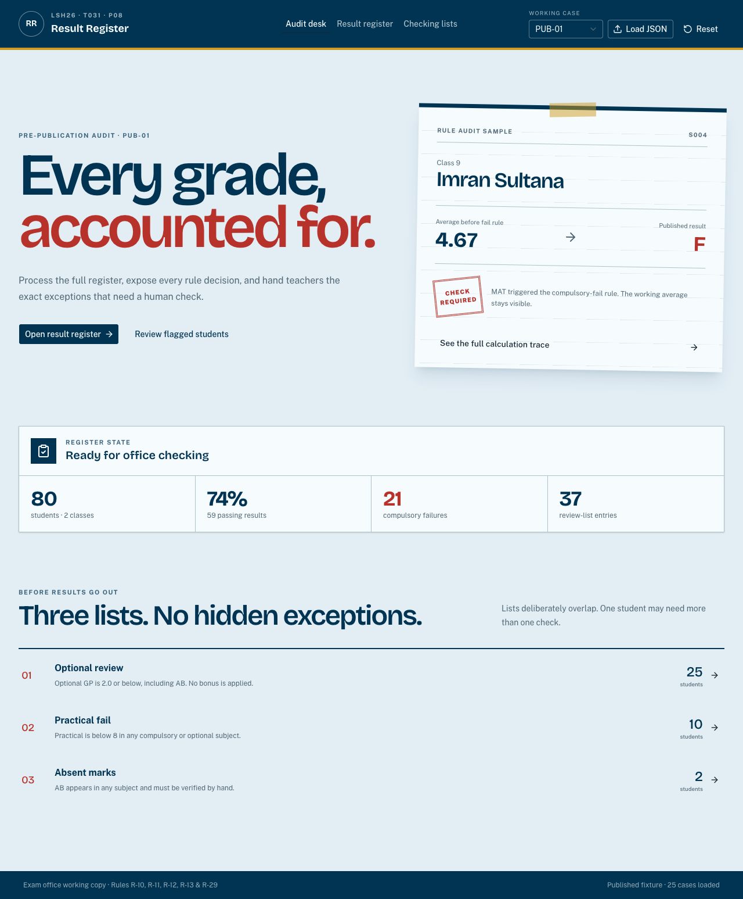

# Result Register

Solution for **LofiStack Hackathon 2026 — P08: School Result Processing and GPA Engine**.



## Project information

- **Team ID:** `LSH26-T031`
- **Problem:** `P08 — School Result Processing and GPA Engine`
- **Repository:** <https://github.com/Seyamalam/lsh26-t031-p08>
- **Live application:** Deployment pending
- **Event start code:** `LSH26-8490-C900`

> Judges should evaluate only the exact 40-character commit SHA entered in the Final Submission Form.

## Solution summary

Result Register turns a raw school marks fixture into a publication-ready register with a trace for every decision. It calculates subject grade points and final GPA, preserves the working average when a compulsory failure forces `0.00 / F`, and produces three independent teacher-checking queues for optional-subject cases, practical failures, and absences.

## Requirements

| Requirement | Status | Where to verify |
| --- | --- | --- |
| R1 — 60+ students, two classes, six compulsory and one optional subject | Complete | Audit desk summary, Result register, case selector, and `src/data/P08_school_results_public.json` |
| R2 — Subject grade points, final GPA, and letter grade | Complete | Result register and `src/domain/engine.ts` |
| R3 — Per-student rule trace | Complete | Select any student; the trace shows raw marks, pass checks, band decision, grade point, formula, uncancelled average, and fail override |
| R4 — Three checking lists | Complete | Checking lists tab; each row shows the triggering subject/reason and opens the student trace |

## Judge walkthrough

1. Open the application. `PUB-01` loads by default with 80 students across Classes 9 and 10.
2. On **Audit desk**, select **See the full calculation trace** for Imran Sultana. Mathematics is 32, so the trace retains the `4.67` average before the compulsory-fail rule and publishes `0.00 / F`.
3. Open **Result register**. Search by name or ID, filter by class, and select any row to inspect all seven subject decisions.
4. Open **Checking lists**. Switch among Optional review, Practical fail, and Absent marks. Select a row to jump directly to that student's trace.
5. Use **Working case** to try any of the 25 published cases.
6. Select **Load JSON** and upload `src/data/P08_school_results_public.json`, or a judge-supplied P08 fixture in the same schema. A malformed fixture produces a readable validation message.
7. Select **Reset** to restore the bundled published fixture and `PUB-01`.

## Rules implemented

- Whole marks use the published boundaries: `<33 = 0`, `33–39 = 1`, `40–49 = 2`, `50–59 = 3`, `60–69 = 3.5`, `70–79 = 4`, and `80–100 = 5`.
- A practical subject requires theory `>=25/75` and practical `>=8/25`; failing either component forces subject GP `0`, regardless of total.
- `AB` produces subject GP `0`. A compulsory `AB` fails the overall result; optional `AB` contributes no bonus but does not itself fail the student.
- `optional bonus = max(0, optional GP - 2)`.
- `uncancelled GPA = min(5, (six compulsory GPs + optional bonus) / 6)`.
- Any compulsory failure publishes `0.00 / F` while the uncancelled GPA remains visible.
- Final letter grades follow R-10 exactly.
- Checking queues follow R-29 and deliberately overlap.

## Published fixture and uploads

The complete organizer-supplied schema 2.2 fixture is bundled at [`src/data/P08_school_results_public.json`](src/data/P08_school_results_public.json). It contains 25 cases; each has at least 60 students and two classes. Uploaded data runs through the same parser and result engine as bundled data.

The upload validator checks:

- a P08 fixture with a non-empty `cases` array;
- exactly six compulsory codes;
- at least 60 students and two classes per case;
- six compulsory marks plus one distinct optional mark per student;
- whole marks from 0–100, or `AB`;
- practical subjects with theory 0–75 and practical 0–25, or `AB`.

## Run locally

### Requirements

- [Bun](https://bun.sh/) 1.2 or newer
- A current browser; no database, private key, or paid service is required

### Setup

```bash
git clone https://github.com/Seyamalam/lsh26-t031-p08.git
cd lsh26-t031-p08
bun install --frozen-lockfile
bun run dev
```

Open <http://localhost:3000>.

### Verification

```bash
bun run test
bun run typecheck
bun run lint
bun run build
```

The test suite covers all grade boundaries, practical component overrides, absence behavior, optional GP/bonus cases, the GPA cap, compulsory-fail override, overlapping checking queues, upload parsing, and all 25 published fixtures.

## Problem-solving approach

The project treats every visible number as an output of a pure domain engine. Subject evaluation happens before student GPA evaluation, and checking queues are derived from the same immutable `StudentResult` objects used by the interface. This keeps the UI from reimplementing or quietly drifting from the official rules.

The interface is designed as a school exam office's audit desk: a ruled working sheet highlights the most counter-intuitive case, the register exposes the complete cohort, and the checking queues behave like hand-verification lists. The full trace is a side sheet so judges can move between students without losing their place.

## Major design decisions

- **Pure rule engine:** `src/domain/engine.ts` has no React or browser dependency, so every formula and edge is unit-testable.
- **Component pass checks precede grade bands:** a high total can never hide a failed theory or practical component.
- **One result model:** roster, trace, summaries, and checking queues all consume the same evaluated object.
- **Non-exclusive checking queues:** the implementation never deduplicates a student out of another applicable list.
- **Local-first judge data:** the official fixture is bundled and judge-supplied files are validated in the browser; no network or secret is required.
- **Accessible audit sheet:** shadcn/Base UI primitives provide keyboard behavior and focus management; the design includes semantic tables, labels, a skip link, visible focus, and reduced-motion handling.

## Technology used

- **Application:** Next.js 16 App Router, React 19, TypeScript
- **Interface:** shadcn/ui (`b0` / base-nova preset), Base UI, Tailwind CSS 4, Lucide icons
- **Testing:** Vitest, TypeScript compiler, ESLint, production Next.js build
- **Data:** organizer-supplied JSON fixture; no backend or database
- **Deployment:** pending

See [`LICENSES.md`](LICENSES.md) for third-party materials.

## Team contribution

| Registered member | GitHub username | Major contribution | Evidence |
| --- | --- | --- | --- |
| Touhidul Alam Seyam | `Seyamalam` | Sole participant: domain modeling, fixture integration, result engine, tests, UI/UX, accessibility, documentation, and verification | `src/domain/`, `src/data/`, `components/results-workspace.tsx`, `app/`, repository history |

## AI usage

OpenAI Codex was used as a coding assistant for implementation, test drafting, interface composition, and documentation. Every output was reviewed through the official clarification rules, automated rule tests, TypeScript, ESLint, a production build, and browser interaction/screenshots. The participant remains responsible for and can explain the submitted work.

## Known limitations

- The application is intentionally a read-only evaluator; it accepts complete fixture JSON rather than offering per-mark editing.
- Uploaded data and filters are browser-session state and reset on page refresh.
- The live URL will be added after deployment; the application currently runs locally without external services.

## Repository records

- [`EVENT.md`](EVENT.md) — event start code and pre-event-material declaration
- [`evaluation-manifest.json`](evaluation-manifest.json) — structured judging evidence
- [`LICENSES.md`](LICENSES.md) — frameworks, libraries, fonts, icons, fixture, and AI disclosure
