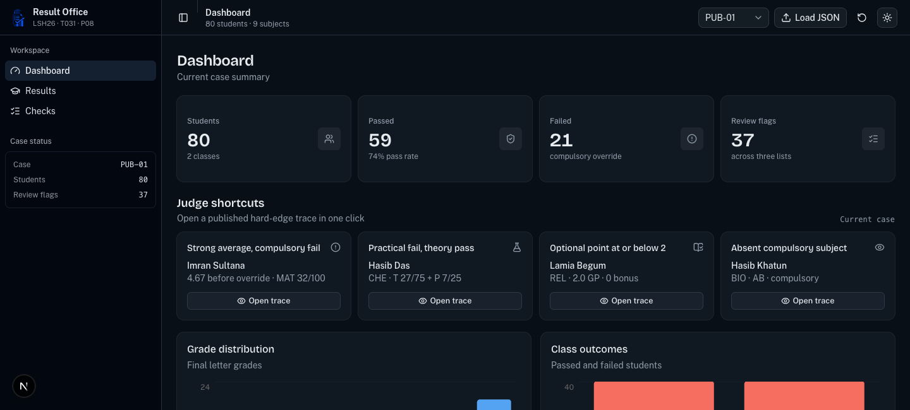
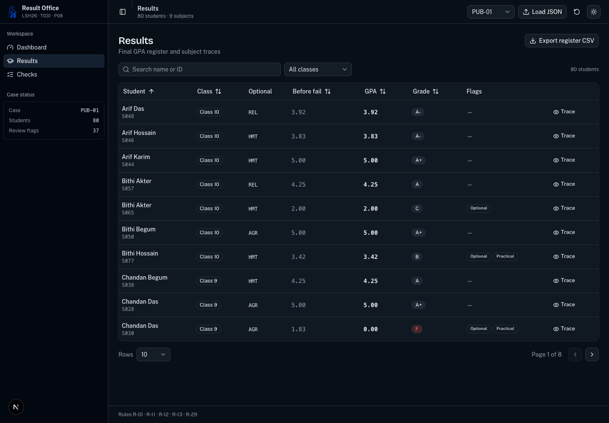
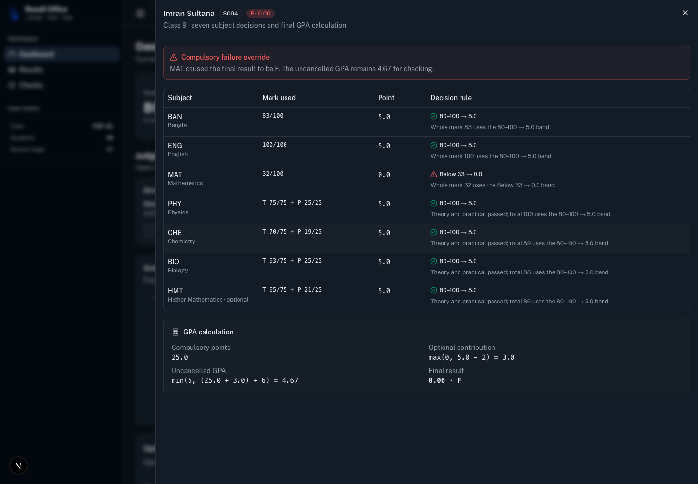
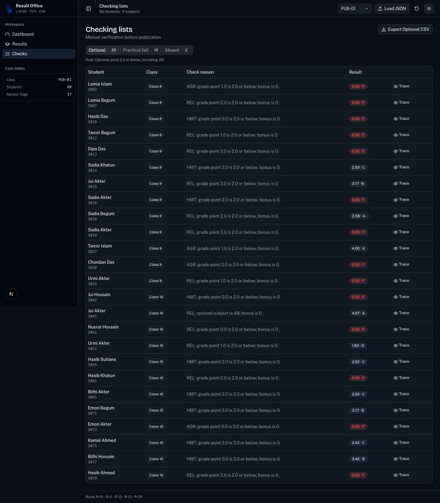
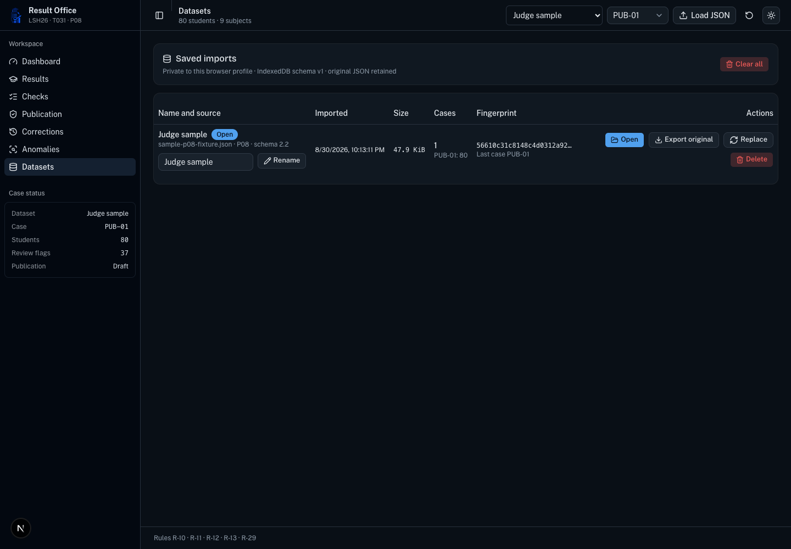
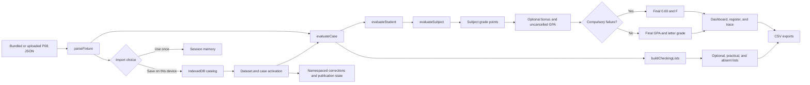

# Result Office

Result Office is the LofiStack Hackathon 2026 submission for P08, School Result Processing and GPA Engine. It processes the organizer fixture in the browser and keeps the calculation evidence beside every published result.

## Project record

| Field | Value |
| --- | --- |
| Team | `LSH26-T031` |
| Problem | `P08` |
| Repository | <https://github.com/Seyamalam/lsh26-t031-p08> |
| Live application | <https://lsh26-t031-p08.vercel.app> |
| Combined demo video | <https://github.com/Seyamalam/lsh26-t031-p08/releases/tag/lsh26-demo> |
| Event start code | `LSH26-8490-C900` |

Judges should evaluate the exact 40-character commit SHA entered in the final submission form.

## Quick judge path

1. Open `/dashboard` with `PUB-01` selected.
2. Use one of the four Judge shortcuts to open the compulsory fail, practical fail, optional rule, or absent trace.
3. Open `/results` to search, sort, filter, paginate, inspect a trace, or export the full register as CSV.
4. Open `/checks` to inspect and export the Optional, Practical fail, and Absent lists separately.
5. Use the Dataset selector to move between bundled data and saved imports. Use the separate Case selector for a case inside that dataset.
6. Open `/datasets` to inspect provenance, rename, export, replace, or delete saved imports.
7. Open `/publication` to resolve review items and move the case through Draft, Checked, Approved, and Published.
8. Open `/corrections` to record a mark correction, inspect its GPA impact, and print the current report card.
9. Open `/anomalies` to review transparent subject, class, component, duplicate, and repeated-mark findings.

[`DEMO-60S.md`](DEMO-60S.md) gives a timed walkthrough.

## Requirement proof

| Required item | Route and interaction | Screenshot | Automated proof | Main source |
| --- | --- | --- | --- | --- |
| R1. At least 60 students in two classes, with the required subjects and hard edges | `/dashboard`, `/results`, case selector, and Judge shortcuts | [`dashboard-judge-evidence.png`](docs/screenshots/dashboard-judge-evidence.png) | `official fixture compatibility` and `judge examples` tests | `src/data/P08_school_results_public.json`, `src/data/fixture.ts`, `src/domain/evidence.ts` |
| R2. Subject points, final GPA, and letter grade | `/results`, Trace, and Export register CSV | [`results-register-export.png`](docs/screenshots/results-register-export.png) | Grade-band, subject, GPA, and CSV tests | `src/domain/engine.ts`, `src/domain/csv.ts`, `components/results-table.tsx` |
| R3. Per-student calculation trace and visible fail cause | Judge shortcut or Trace from `/results` and `/checks` | [`student-trace-hard-edge.png`](docs/screenshots/student-trace-hard-edge.png) | Compulsory override and hard-edge tests | `components/student-trace.tsx`, `src/domain/engine.ts` |
| R4. Optional, practical fail, and absent checking lists | `/checks`, three tabs, Trace, and one CSV export per list | [`checking-lists-export.png`](docs/screenshots/checking-lists-export.png) | Checking-list overlap and CSV tests | `components/checks-view.tsx`, `src/domain/engine.ts`, `src/domain/csv.ts` |

## Screenshots

### Dashboard and judge shortcuts



### Result register and CSV export



### Compulsory fail trace



### Checking lists



### Saved dataset manager



## Calculation flow



The UI does not recalculate results. The register, charts, traces, checking lists, and exports all consume the same `StudentResult` objects from the domain engine.

## Rules in the engine

- Whole marks use these boundaries: below 33 is 0, 33-39 is 1, 40-49 is 2, 50-59 is 3, 60-69 is 3.5, 70-79 is 4, and 80-100 is 5.
- A practical subject requires theory `>=25/75` and practical `>=8/25`. Failing either component forces subject GP `0`, even when the total would pass.
- `AB` produces subject GP `0`. A compulsory `AB` fails the overall result. An optional `AB` gives no bonus but does not itself fail the student.
- Optional bonus is `max(0, optional GP - 2)`.
- Uncancelled GPA is `min(5, (six compulsory GPs + optional bonus) / 6)`.
- Any compulsory failure publishes `0.00 / F`. The trace still shows the uncancelled GPA and the subject that caused the override.
- Final letters follow R-10. The three R-29 checking lists can overlap.

## Importing a fixture

The organizer fixture is bundled at [`src/data/P08_school_results_public.json`](src/data/P08_school_results_public.json). A smaller valid file containing `PUB-01` is checked in at [`public/sample-p08-fixture.json`](public/sample-p08-fixture.json). Download it from the running app at `/sample-p08-fixture.json`, then use Load JSON in the header. Choose Use once for session memory or Save on this device for an explicit browser-local copy.

An import must have this top-level shape:

```json
{
  "schema_version": "2.2",
  "problem_id": "P08",
  "cases": [
    {
      "case_id": "PUB-01",
      "subjects": [
        { "code": "BAN", "name": "Bangla", "practical": false },
        { "code": "PHY", "name": "Physics", "practical": true }
      ],
      "compulsory": ["BAN", "ENG", "MAT", "PHY", "CHE", "BIO"],
      "students": [
        {
          "id": "S001",
          "name": "Arif Hossain",
          "class": "Class 9",
          "optional": "HMT",
          "marks": {
            "BAN": 55,
            "ENG": 61,
            "MAT": 70,
            "PHY": { "theory": 60, "practical": 20 },
            "CHE": { "theory": 40, "practical": 7 },
            "BIO": "AB",
            "HMT": { "theory": 50, "practical": 15 }
          }
        }
      ]
    }
  ]
}
```

The excerpt shows the mark formats. A valid case must include at least 60 students in two classes, exactly six compulsory subject codes, and one distinct optional subject per student. Use the checked-in sample when testing an import.

The validator accepts JSON files up to 5 MiB. It checks schema version 2.2, unique and trimmed case, subject, and student identifiers, integer mark ranges, practical mark objects, subject codes, and the seven-mark requirement. ZIP and other file types are rejected before reading. Files above 250 KiB are parsed and validated in a module Web Worker, with a synchronous fallback when workers are unavailable. A rejected file produces a readable error without replacing the current data.

## Dataset storage

- Use once keeps the validated fixture and its office state in memory for the current tab session.
- Save on this device writes a versioned IndexedDB record with a UUID, chosen name, source filename, import time, byte size, SHA-256 fingerprint, case summary, original JSON, normalized fixture, and last opened case.
- Exact file fingerprints are deduplicated. The existing saved record opens instead of creating a second copy.
- `/datasets` provides open, rename, original JSON export, validated replacement, delete, and clear-all controls.
- Local storage contains only the last selected saved dataset ID. On refresh, the app loads that record from IndexedDB. The fixture itself never goes into local storage.
- Corrections and publication state use `datasetId + caseId` keys in IndexedDB. Derived results, checks, charts, and anomaly findings are recalculated and are never persisted.
- A three-entry least-recently-used memory cache avoids repeated fixture cloning while preventing unbounded memory growth.
- Delete and clear-all remove matching office state. Deleting the active dataset falls back to bundled data.

## Office controls

- `/publication` maintains a case-specific review queue. Every optional, practical-fail, and absent exception must be marked Verified, Corrected, or Waived before the case can leave Draft. Stage changes cannot be skipped, and Published is unavailable while a required item is open.
- `/corrections` stores the original and replacement mark, source reason, timestamp, and before/after GPA. Corrected marks feed the same result engine used by the register, checks, trace, and report card. Browser Print produces the selected student's current report card.
- `/anomalies` uses only descriptive statistics and exact comparisons. Every finding states its values and threshold. It does not predict marks or change a result.

For bundled and explicitly saved datasets, workflow and correction state is stored by dataset and case in IndexedDB. Use once remains session-only. A correction always returns the affected case to Draft and rebuilds its review queue.

## Run locally

You need Bun 1.2 or newer and a current browser. The project has no database, private key, or paid service.

```bash
git clone https://github.com/Seyamalam/lsh26-t031-p08.git
cd lsh26-t031-p08
bun install --frozen-lockfile
bun run dev
```

Open <http://localhost:3000>.

## Verify the build

```bash
bun run test
bun run typecheck
bun run lint
bun run build
```

The tests cover grade boundaries, practical component overrides, absence handling, optional bonus boundaries, GPA capping, compulsory failure, list overlap, hardened fixture parsing, all 25 published cases, judge examples, CSV output, publication gates, correction snapshots and GPA impact, report-card projections, and anomaly explanations.

## Design and implementation choices

- `src/domain/engine.ts` is independent of React and browser APIs.
- Theory and practical checks run before grade-band lookup, so a high combined total cannot hide a failed component.
- The uncancelled GPA remains in the result model after a compulsory failure.
- Checking lists are non-exclusive and come from the same evaluated result used by the trace.
- Imported fixtures are processed locally. The app needs no network request after it loads.
- Next.js App Router pages separate summary, register, and checking work. The shared trace sheet preserves the current page and filters.
- Publication, correction, and anomaly routes share the same corrected case state. Persistent office state is scoped by dataset ID and case ID, which prevents matching case names from colliding.
- Dataset and case changes remount route-local controls before deriving results, checks, charts, and anomalies from the activated source.
- The anomaly scanner uses fixed thresholds, z scores, class means, component percentages, and exact signatures. It never predicts a grade.
- shadcn and Base UI primitives provide keyboard behavior and focus management. The app also has semantic tables, chart accessibility layers, a skip link, visible focus, responsive navigation, dark mode, and reduced-motion handling.

## Technology and licenses

The application uses Next.js 16.3.3, React 19.2.8, TypeScript, shadcn/ui, Base UI, Tailwind CSS 4, TanStack React Table, Recharts, Vitest, Lucide, next-themes, and the beUI file-upload block. Deployment is on Vercel.

[`LICENSES.md`](LICENSES.md) records versions, licenses, assets, and disclosures.

## Team contribution

| Registered member | GitHub username | Contribution |
| --- | --- | --- |
| Touhidul Alam Seyam | `Seyamalam` | Sole implementation owner for domain modeling, fixture integration, engine, tests, interface, accessibility, documentation, and verification |
| Pratik Dev | Not provided | Unable to participate in the build due to a severe health crisis |

## AI disclosure

AI assistance = OpenCode was used for implementation support. All outputs were verified with automated bun tests, browser qa, production builds in Vercel, linters and live deployment checks.

## Known limitations

- Corrections do not modify the retained original JSON. Export original always returns the exact imported source.
- IndexedDB data belongs to the current browser profile and device. Clearing site data removes it.
- Browser privacy settings or storage quotas can block saving. Use once remains available when persistent storage is unavailable.

## Repository records

- [`EVENT.md`](EVENT.md) records the event start code and pre-event material declaration.
- [`evaluation-manifest.json`](evaluation-manifest.json) maps requirements to evidence.
- [`LICENSES.md`](LICENSES.md) lists third-party material and AI use.
